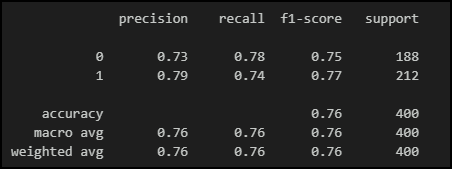

# Challenge Module 18
## Neural Network Challenge: An ASU AIML Challenge by CA Frisby

### Overview
Import a .csv file from an online source.  Prepare the data for
a neural network model.  Compile and evaluate the model using a deep neural
network.  Predict the load repayment success by using the model.  Discuss 
further recommendations regarding data collection and applications for student 
loans.  This is strictly an academic model. 

References:  Starter code was provided by ASU AIML. 
             
### Part 1:  Prepare the data.

The data set including primarily floating point numbers, except the output data
was in integer format. The output or "y" column was already in a "0-1" format,
which did not require any additional processing.  The data was then split into a
training and testing dataset with train_test_split.  StandardScaler was used to
scale the float point numbers that made up the "X" data set.

### Part 2:  Compile and evaluate a deep neural network model.
A deep neural network was created with two hidden layers and an output layer.  
A Keras deep learning module was set up with the following parameters:
    1.  A first dense layer with 6 neurons and the "relu" activation function
    2.  A second dense layer with 3 neurons and the "relu" activatin function
    3.  An output layers with one neuron and the "sigmoid" activation function.
The model was compiled and fit using the binary crossentropy losss function, the
adam optimizer, and the accuracy evaluation metric.  Execution was set to 50
epochs. 

### Part 3: Predict loan repayment success.
The first run with 50 epochs resulted in a model accuracy of .7325 and the loss
was .5382. A second run with 100 epochs resulted in a slightly better model
accuracy of .76 and loss of .53.  This definitely leaves room for further 
adjustments (adjusting number of hidden layers, number of neurons, number of 
epochs) to improve the accuracy and reduce the loss error, if possible.  
A third model was attempted with a third neural layer with a neuron count of 
6-3-3 for first, second, and third layer, with no significant improvement in 
accuracy.  This third model was not included here; only the second model with 
2 hidden layers is presented.  
The classification report indicated that the model was slightly better at
correctly predicting "1" than correctly predicting "0".  A kerastuner could be
applied to see if accuracy can be increased. 

### Part 4: Discuss creating a recommendation system for student loans.
Data actually collected and some additional recommendations include the
following: payment history, location (which may be different than college), 
name of college, stem degree score, gpa ranking, alumni success, degree major, 
time to completion, finance workshop score, cohort ranking, total loan score, 
and financial aid score.  The data processing is considered a collaborative 
filtering process.  Real world challenges include legal restriction on loan
application dating and lending processes, as well as concerns for error that
could result in potentially successful students and borrowers not getting the
financial aid that they need to further their education.  

